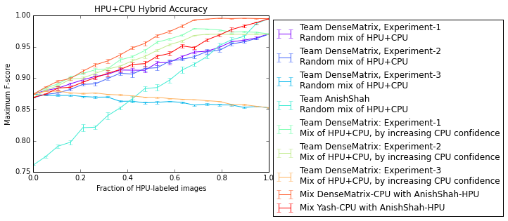

ARC Challenge: Bounding Box Evaluation Framework
================================================

Here is a (preliminary!) evaluation framework for the Aspiring Research Challenge.

Project status
--------------

Right now, we can parse bounding boxes from the **Single-Scale** subset of **UIUC Cars,** using the following teams' data:

- Team DenseMatrix, all three HPU experiments and one CPU;
- Yash's team's CPU (no confidence scores);
- Anish Shah's team's CPU (no confidence scores);

We haven't got this working for Caltech or SVHN yet.

To make the plot:
-----------------

- Install the following Python packages:
  - Numpy
  - Matplotlib
  - Pandas (to parse some data; feel free to comment these out if you don't need all the lines on the plot)

If you need a quick way to install Python along with these related packages, [Enthought's Canopy python distribution](https://enthought.com/products/canopy/) or [Anaconda](https://store.continuum.io/cshop/anaconda/) provide a Python interpreter, an editor, and a bunch of scientific packages that work on Mac OSX and Windows. There are (well-hidden) free versions of both of these systems. The [Python Wiki](http://www.scipy.org/install.html) also has some links to these packages.

- Once you have Python working, run `plot_uiuc_cars.py`, which will show the figure on your screen.

To add your bounding boxes to this plot:
----------------------------------------

To add your bounding boxes, we need the following information for *each* image:

- The image file name
- A list of bounding boxes for each image, with the coordinates of the *top left corner*, the *width*, and the *height* of the box.
- If you are using a CPU algorithm, each bounding box should have a *confidence score* that indicates your algorithm's confidence in its detection
- If you are using an HPU algorithm, each bounding box should include the *time in seconds* that it took to label each box.

For good examples of formatting to imitate, see [StudentData-UIUC-Cars/Example Bounding Box Format.json](StudentData-UIUC-Cars/Example Bounding Box Format.json)

Either **confirm to this JSON format**, or **write code to parse your data**, using the `plot_uiuc_cars.py` file as a reference. This file simply parses teams' data and adds the line to the plot.

You can send this data to us by submitting a pull request, posting it to the Piazza data thread, or by messaging us on slack with a link to your data files.

If you need a team's bounding boxes:
------------------------------------

If you are building an HPU and want to base your bounding boxes off of a certain team's bounding boxes, the format is reasonably simple:

    {"test-0.png": [list of bounding boxes inside this image],
     "test-1.png": [list of bounding boxes],
     "test-2.png": [],
     }

where each bounding box is an instance of the `BoundingBox` class from `bb_utils.py`.

In this example, the detector was run on three images and didn't find any in `test-2.png`.

Here is an example which outputs Team DenseMatrix's CPU bounding boxes in a space-separated format:

    Python 2.7.9 (default, Dec 11 2014, 04:42:00)
    [GCC 4.9.2] on linux2
    Type "help", "copyright", "credits" or "license" for more information.
    >>> import plot_uiuc_cars
    Loading data...
    >>> for image_name, boxes in plot_uiuc_cars.DenseMatrix3_CPU.items():
    ...     for box in boxes:
    ...         print image_name, box.left, box.top, box.width, box.height
    ...
    test-138.png 41 38 111 43
    test-104.png -1 39 118 46
    test-110.png 75 52 123 48
    test-51.png 13 31 120 46
    test-92.png -7 52 122 47
    test-93.png -28 -56 182 70

If you would like to use a team's bounding boxes but can't get the code to work, let us know what team you need and what format you want it in, and we will be happy to send you the file.
